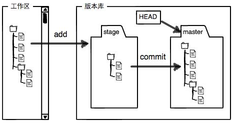
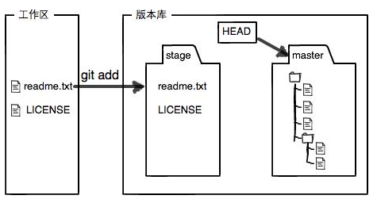
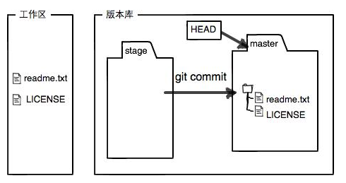
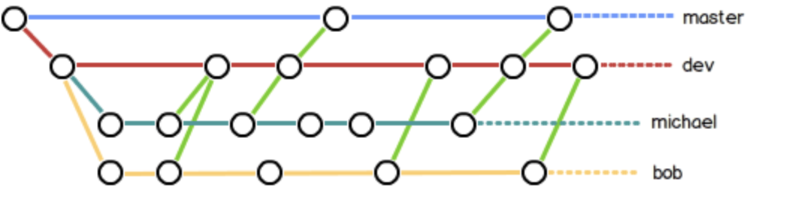
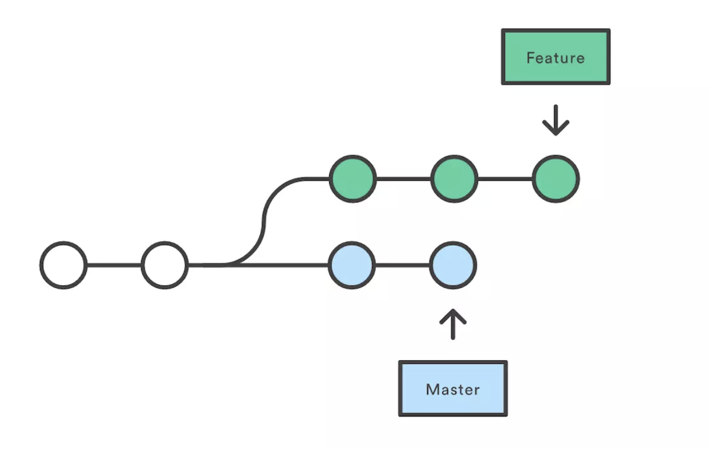
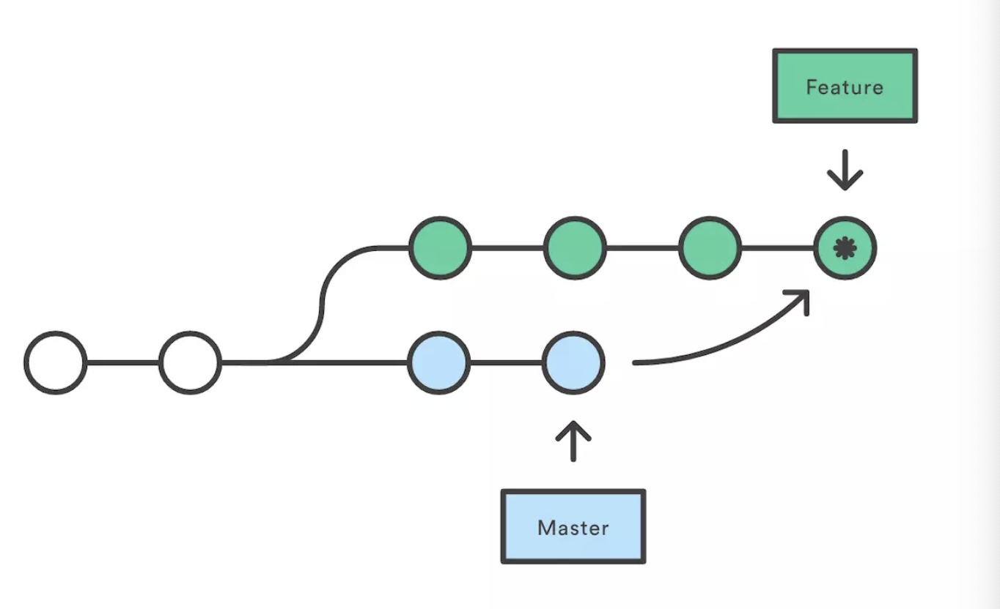
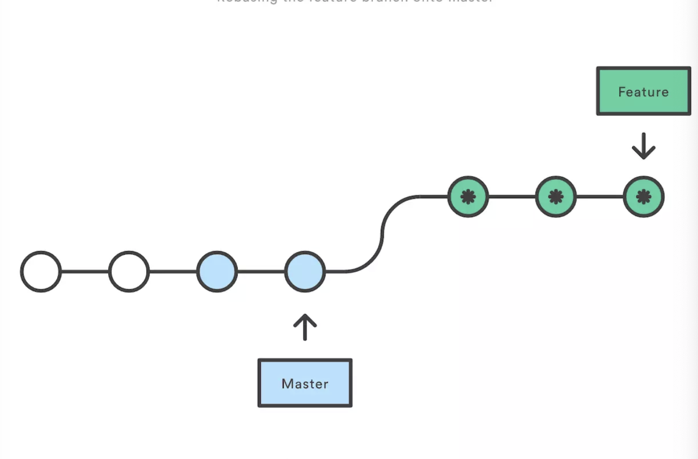

[git 学习](https://www.liaoxuefeng.com/wiki/896043488029600/897013573512192)

## 创建版本库

初始化一个 git 仓库，使用

```js
git init
```

命令

添加文件到 git 仓库，分两步

1.使用命令

```
git add <file>
```

可反复多次使用，添加多个文件

2.使用

```
git commit -m <message>
```

完成

## 时光机穿梭

- 要随时掌握工作区的状态，使用

```
git status
```

如果

`
git status
`

告诉你有文件被修改过，用

```
git diff
```

```js
$ git diff readme.txt
diff --git a/readme.txt b/readme.txt
index 46d49bf..9247db6 100644
--- a/readme.txt
+++ b/readme.txt
@@ -1,2 +1,2 @@
-Git is a version control system.
+Git is a distributed version control system.
 Git is free software.
```

### untracked 和 not staged 的区别

untrack 表示是新文件，没有被 add 过，是为跟踪的意思。

not staged 表示 add 过的文件，即跟踪文件，再次修改没有 add，就是没有暂存的意思

## 版本回退

### 文件快照

每当你觉得文件修改到一定程度的时候，就可以“保存一个快照”，这个快照在 Git 中被称为 commit。一旦你把文件改乱了，或者误删了文件，还可以从最近的一个 `commit` 恢复

- HEAD 指向的版本就是当前版本。因此，git 允许我们在版本的历史之间穿梭

```
git reset --hard commit_id
```

- 穿梭前，用

```
git log
```

可以查看提交历史，以便确定要回退到哪个版本

- 要重返未来，用

```
git reflog
```

查看命令历史，以便确定要回到未来的哪个版本

## 工作区和暂存区

工作区有一个隐藏目录.git,这个不算工作区，而是 git 的版本库。

git 的版本库里存了很多东西，其中最重要的就是称为 state 的暂存区，还有 Git 为我们创建的第一个分支`master`，以及指向 master 的一个指针 HEAD。



把文件往 git 版本库里添加的时候，是分两步执行的：

- 用`git add`把文件添加进去，实际上就是把文件修改添加到暂存区



- 用`git commit`提交更改，实际上就是把暂存区的所有内容提交到当前分支



## 管理修改

为什么 git 比其他版本控制系统设计得优秀，因为 git 跟踪并管理的是修改，而非文件。

每次修改，如果不用 `git add` 到暂存区，那就不会加入到 commit 中。

## 撤销修改

命令

```
git checkout -- readme.txt
```

意思就是把 readme.txt 文件在工作区的修改全部撤销，这里有两种情况。

- readme.txt 自修改后还没有被放到暂存区，现在撤销修改就回到和版本库一模一样的状态

- reademe.txt 已经添加到暂存区后，又做了修改，现在撤销修改就回到添加到暂存区后的状态。

总之就是让这个文件回到最近一次 git commit 或 git add 时的状态。

`git checkout -- file` 命令中的--很重要，没有--，就变成了“切换到另一个分支”的命令，我们在后面的分支管理中会再次遇到 git checkout 命令

用命令

```
git reset HEAD <file>
```

可以把暂存区的修改撤销掉（unstage），重新放回工作区：

`git reset` 命令既可以回退版本，也可以把暂存区的修改回退到工作区。当我们用 HEAD 时，表示最新的版本。

### 总结

场景 1：当你改乱了工作区某个文件的内容，想直接丢弃工作区的修改时，用命令

```
git checkout -- file。
```

场景 2：当你不但改乱了工作区某个文件的内容，还添加到了暂存区时，想丢弃修改，分两步，第一步用命令

```
git reset HEAD <file>
```

就回到了场景 1，第二步按场景 1 操作。

场景 3：已经提交了不合适的修改到版本库时，想要撤销本次提交，参考版本回退一节，不过前提是没有推送到远程库。

## 删除文件

在 git 中，删除也是一个修改操作。当在文件系统中删除某个文件时，使用`git status`，
git 会告诉你哪些文件被删除了：

```js
$ git status
On branch master
Changes not staged for commit:
  (use "git add/rm <file>..." to update what will be committed)
  (use "git checkout -- <file>..." to discard changes in working directory)

	deleted:    test.txt

no changes added to commit (use "git add" and/or "git commit -a")
```

现在有两个选择：一是确实要从版本库中删除该文件，那就用命令`git rm`删掉，并且
`git commit`，现在文件就从版本库中被删除了。

另一种情况是删错了，因为版本库里还有呢，所以可以轻松把误删文件恢复：

```
git checkout -- test.txt
```

`git checkout`其实是用版本库里的版本替换工作区的版本，无论工作区是修改还是删除，都可以"一键还原"。但是**注意的是从来没有被添加到版本库就被删除的文件，是无法恢复的！**

## 远程仓库

你的本地 Git 仓库和 GitHub 仓库之间的传输是通过 SSH 加密的，所以，需要一点设置。

为什么 GitHub 需要 SSH Key 呢？因为 GitHub 需要识别出你推送的提交确实是你推送的，而不是别人冒充的，而 Git 支持 SSH 协议，所以，GitHub 只要知道了你的公钥，就可以确认只有你自己才能推送。

当然，GitHub 允许你添加多个 Key。假定你有若干电脑，你一会儿在公司提交，一会儿在家里提交，只要把每台电脑的 Key 都添加到 GitHub，就可以在每台电脑上往 GitHub 推送了。

## 添加远程库

要关联一个远程库，使用命令

```
git remote add origin git@server-name:path/repo-name.git；
```

关联后，使用命令

```
git push -u origin master
```

第一次推送 master 分支的所有内容；

此后，每次本地提交后，只要有必要，就可以使用命令 `git push origin master` 推送最新修改；

分布式版本系统的最大好处之一是在本地工作完全不需要考虑远程库的存在，也就是有没有联网都可以正常工作，而 SVN 在没有联网的时候是拒绝干活的！当有网络的时候，再把本地提交推送一下就完成了同步，真是太方便了！

## 从远程库克隆

如果有多个人协作开发，那么每个人各自从远程克隆一份就可以了。

你也许还注意到，GitHub 给出的地址不止一个，还可以用https://github.com/michaelliao/gitskills.git这样的地址。实际上，Git支持多种协议，默认的git://使用ssh，但也可以使用https等其他协议。

使用 https 除了速度慢以外，还有个最大的麻烦是每次推送都必须输入口令，但是在某些只开放 http 端口的公司内部就无法使用 ssh 协议而只能用 https。

要克隆一个仓库，首先必须知道仓库的地址，然后使用 git clone 命令克隆。

Git 支持多种协议，包括 https，但通过 ssh 支持的原生 git 协议速度最快

## 分支管理

分支在实际中有什么用呢？假设你准备开发一个新功能，但是需要两周才能完成，第一周你写了 50%的代码，如果立刻提交，由于代码还没写完，不完整的代码库会导致别人不能干活了。如果等代码全部写完再一次提交，又存在丢失每天进度的巨大风险。

现在有了分支，就不用怕了。你创建了一个属于你自己的分支，别人看不到，还继续在原来的分支上正常工作，而你在自己的分支上干活，想提交就提交，直到开发完毕后，再一次性合并到原来的分支上，这样，既安全，又不影响别人工作。

Git鼓励大量使用分支：

查看分支：git branch

创建分支：git branch  `name`

切换分支：git checkout `name` 或者git switch `name`

创建+切换分支：git checkout -b `name`或者git switch -c `name`

合并某分支到当前分支：git merge `name`

删除分支：git branch -d `name`

## 解决冲突

当Git无法自动合并分支时，就必须首先解决冲突。解决冲突后，再提交，合并完成。

解决冲突就是把Git合并失败的文件手动编辑为我们希望的内容，再提交。

用git log --graph命令可以看到分支合并图

## 分支管理策略

在实际开发中，我们应该按照几个基本原则进行分支管理：

首先，master分支应该是非常稳定的，也就是仅用来发布新版本，平时不能在上面干活；

那在哪干活呢？干活都在dev分支上，也就是说，dev分支是不稳定的，到某个时候，比如1.0版本发布时，再把dev分支合并到master上，在master分支发布1.0版本；

你和你的小伙伴们每个人都在dev分支上干活，每个人都有自己的分支，时不时地往dev分支上合并就可以了。

所以，团队合作的分支看起来就像这样：



通常，合并分支时，如果可能，Git会用Fast forward模式，但这种模式下，删除分支后，会丢掉分支信息。

如果要强制禁用Fast forward模式，Git就会在merge时生成一个新的commit，这样，从分支历史上就可以看出分支信息。

Git分支十分强大，在团队开发中应该充分应用。

合并分支时，加上--no-ff参数就可以用普通模式合并，合并后的历史有分支，能看出来曾经做过合并，而fast forward合并就看不出来曾经做过合并。

```js
git merge --no-ff -m "merge with no-ff" dev
```

## bug分支

修复bug时，我们会通过创建新的bug分支进行修复，然后合并，最后删除；

当手头工作没有完成时，先把工作现场git stash一下，然后去修复bug，修复后，再git stash pop，回到工作现场；

在master分支上修复的bug，想要合并到当前dev分支，可以用`git cherry-pick `<commit>命令，把bug提交的修改“复制”到当前分支，避免重复劳动

## Feature分支

开发一个新feature，最好新建一个分支；

如果要丢弃一个没有被合并过的分支，可以通过git branch -D `name`强行删除

## 多人协作

多人协作的工作模式通常是这样：

首先，可以试图用git push origin <branch-name>推送自己的修改；

如果推送失败，则因为远程分支比你的本地更新，需要先用git pull试图合并；

如果合并有冲突，则解决冲突，并在本地提交；

没有冲突或者解决掉冲突后，再用git push origin <branch-name>推送就能成功！

如果git pull提示no tracking information，则说明本地分支和远程分支的链接关系没有创建，用命令git branch --set-upstream-to <branch-name> origin/<branch-name>。

这就是多人协作的工作模式，一旦熟悉了，就非常简单。

查看远程库信息，使用git remote -v；

本地新建的分支如果不推送到远程，对其他人就是不可见的；

从本地推送分支，使用git push origin branch-name，如果推送失败，先用git pull抓取远程的新提交；

在本地创建和远程分支对应的分支，使用git checkout -b branch-name origin/branch-name，本地和远程分支的名称最好一致；

建立本地分支和远程分支的关联，使用git branch --set-upstream branch-name origin/branch-name；

从远程抓取分支，使用git pull，如果有冲突，要先处理冲突。


## Rebase

[参考](https://www.liaoxuefeng.com/wiki/896043488029600/1216289527823648)

rebase操作可以把本地未push的分叉提交历史整理成直线；

rebase的目的是使得我们在查看历史提交的变化时更容易，因为分叉的提交需要三方对比

例子：



进行merge



merge特点：

+ 自动创建一个新的commit
+ 如果合并的时候遇到冲突，仅需要修改后重新commit
+ 优点：记录了真实的commit情况，包括每个分支的详情
+ 缺点：因为每次merge会自动产生一个merge commit，所以在使用一些git的GUI
tools，特别是commit比较频繁时，看到分支很杂乱


rebase:

本质是变基，即找公共祖先



rebase特点：

+ 会合并之前的commit历史
+ 优点：得到更简洁的项目历史，去掉了merge commit
+ 缺点：如果合并出现代码问题不容易定位，因为re-write了history


## 标签管理

tag就是一个让人容易记住的有意义的名字，它跟某个commit绑在一起。

## 创建标签

命令git tag <tagname>用于新建一个标签，默认为HEAD，也可以指定一个commit id；

命令git tag -a <tagname> -m "blablabla..."可以指定标签信息；

命令git tag可以查看所有标签。

## 使用Github

[参考](https://www.liaoxuefeng.com/wiki/896043488029600/900937935629664)


在GitHub上，可以任意Fork开源仓库；

自己拥有Fork后的仓库的读写权限；

可以推送pull request给官方仓库来贡献代码。

## git命令add, commit， push


git有好几个区，工作区（workspace）、暂存区（index）、本地仓库（local repository）、还有远程仓库（remote repository）。远程仓库为我们保存一份代码，如github，而工作区、暂存区和本地仓库都在本地，这也就是为什么我们在没有网络的环境下也能使用git提交（commit）代码，因为提交仅仅是提交到本地仓库中，待有网络之后在推送（push）到远程仓库